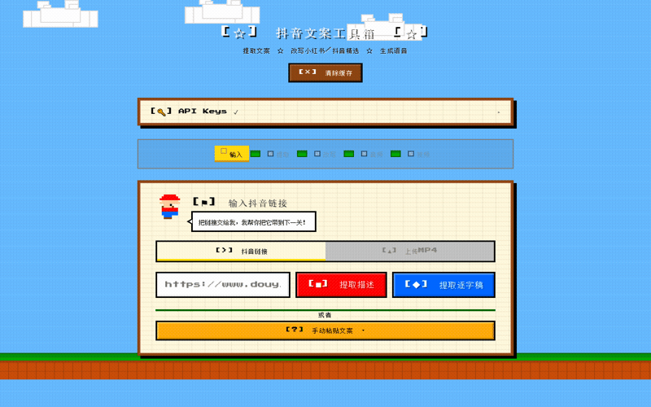

<p align="center">
  
</p>

<h1 align="center">🐳 WHALE — 抖音文案智能改写工具</h1>
<h3 align="center">抖音链接 → 逐字稿 → AI改写（小红书+抖音）→ TTS语音 → 视频合成</h3>

<p align="center">
  
  
  
  
  
  
  
</p>

---

## 为什么你需要这个工具？

做自媒体的都知道：**看别人视频很简单，把自己的想法变成视频很痛苦。** WHALE 把最花时间的文案提取、改写、配音、配画面全部自动化。

| 手工操作 | WHALE 自动化 |
|------|------|
| 看视频、暂停、手抄文案 | 🎬 Puppeteer 10 秒提取 |
| 自己改写、想标题、找钩子 | ✍️ DeepSeek 双风格改写 |
| 找配音、调语速、反复录 | 🎙️ edge-tts 6 种语音 |
| 找素材、剪辑、加字幕 | 🎥 Pexels + ffmpeg 自动合成 |

## ✨ 五阶段流水线

| # | 阶段 | 技术 | 耗时 | 产出 |
|---|------|------|------|------|
| 1 | 🎬 提取描述 | Puppeteer | ~10s | 视频标题、作者、互动数据 |
| 2 | 📝 逐字稿 | faster-whisper | 2-5min | 完整语音转文字 |
| 3 | ✍️ AI 改写 | DeepSeek | ~5s | 小红书风格 / 抖音精选风格 |
| 4 | 🎙️ TTS 语音 | edge-tts + SSML | ~10s | MP3 音频文件 |
| 5 | 🎥 视频合成 | Pexels + ffmpeg | ~30s | 1080×1920 竖屏 MP4 |

## 两种改写风格

| | 💄 小红书 | 🎵 抖音精选 |
|------|------|------|
| 标题优化 | ✅ SEO 关键词 | ✅ 3 秒钩子 |
| 正文结构 | 7 种模板 | TTS 友好 |
| 去 AI 味 | ✅ 18 种钩子 | ✅ 口语化 |
| emoji | ✅ | ❌（TTS 会读出来） |
| 结尾引导 | 互动提问 | 收藏+关注 |

## 🎮 Mario 像素风 UI

4 个马里奥角色精灵 — 马里奥（输入）→ 路易吉（提取）→ 碧琪（改写）→ 耀西（音频），绿色管道流水线，金币黄焦点高亮。**零框架，原生 HTML/CSS/JS。**

## 🚀 快速开始

```bash
git clone https://github.com/Rookage/whale.git
cd whale
npm install
pip install edge-tts faster-whisper
cp .env.example .env  # 填入 DeepSeek API Key
npm start             # http://localhost:3000
```

### 可选配置

```env
PEXELS_API_KEY=your-key-here  # 视频配图需要，免费注册 pexels.com/api
```

## 🛠️ 技术栈

| 层 | 技术 | 说明 |
|----|------|------|
| 浏览器提取 | Puppeteer v25 | 拦截 aweme/detail API |
| 语音识别 | faster-whisper small | 常驻守护进程模式 |
| AI 改写 | DeepSeek API | deepseek-chat |
| 语音合成 | edge-tts v7.2.8 | 6 种中文语音 + SSML |
| 图片搜索 | Pexels API | 免费图库 |
| 视频合成 | ffmpeg v8.1.1 | 1080×1920 竖屏 |

## 📄 许可证

MIT License

## ⭐ 支持项目

如果这个工具对你有帮助，请给个 Star ⭐ 让更多人看到！

---

<p align="center">
  <sub>Built with ❤️ by <a href="https://github.com/Rookage">Rookage</a></sub>
</p>
